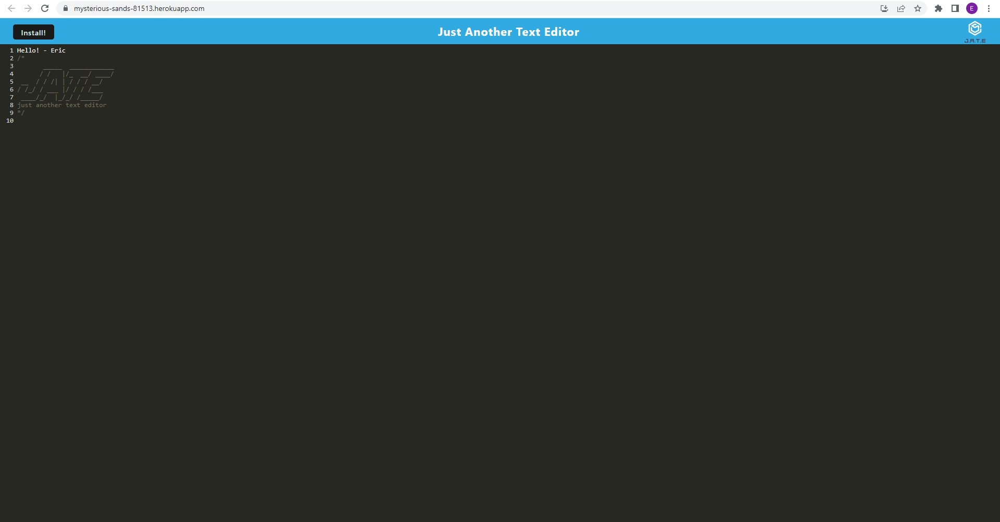

# Installable-Text-Editor


## Description

This is a [Progressive Web App](https://developer.mozilla.org/en-US/docs/Web/Progressive_web_apps) utilizing [IndexedDB API](https://developer.mozilla.org/en-US/docs/Web/API/IndexedDB_API).

```md
Features:

- Use as a text editor
- Install locally
```
## License
See LICENSE

## Table of Contents

  * [Description](#description)
  * [License](#license)
  * [How to Use](#usage)
  * [Demo](#demo)
  * [Questions](#questions)
  * [Credits](#credits)


## How to Use
Link to live demo:\
[https://mysterious-sands-81513.herokuapp.com/](https://mysterious-sands-81513.herokuapp.com/)

or

Required to use locally:
```md
Node.js
```

To run:

- npm install
- npm start

## Demo
Deployed to Heroku here: [https://mysterious-sands-81513.herokuapp.com/](https://mysterious-sands-81513.herokuapp.com/)

## Screenshots




## Questions
You may contact me on GitHub.


## Credits

University of Toronto: School of Continuing Studies